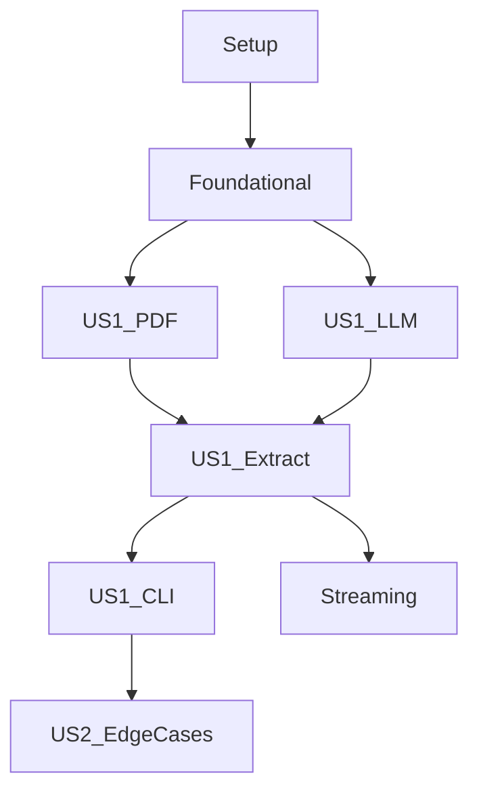

# Tasks: PDF Specification Extractor

**Feature**: `001-pdf-spec-extractor`
**Status**: Complete

## Phase 1: Setup
**Goal**: Initialize the project, dependencies, and environment configuration.

- [X] T001 Initialize Go module `github.com/spherical/pdf-extractor`
- [X] T002 Create project structure (`cmd/`, `internal/`, `pkg/`)
- [X] T003 Install dependencies (`go-fitz`, `net/http`, `godotenv`)
- [X] T004 Create `.env` and `.gitignore` handling
- [X] T005 Create `.env.template`

## Phase 2: Foundational
**Goal**: Implement core data structures and interfaces blocking user stories.

- [X] T006 Define core domain entities (`Document`, `PageImage`) in `internal/domain/models.go`
- [X] T007 Define `ExtractionResult` and `StreamEvent` structs in `internal/domain/models.go`
- [X] T008 Define `Converter` and `Extractor` interfaces in `internal/domain/interfaces.go`
- [X] T009 Implement basic logging and error handling utilities

## Phase 3: User Story 1 - Extract Product Data from PDF (P1)
**Goal**: Core functionality - PDF to Markdown conversion with table support.
**Independent Test**: Convert a sample PDF to Markdown and verify specs/tables exist.

- [X] T010 [US1] Create integration test case with sample PDF `/Users/seemant/Documents/Projects/AIOutcallingAgent/Uploads/Arena-Wagon-r-Brochure.pdf` in `tests/integration/pdf_test.go` (Red Phase)
- [X] T011 [US1] Create unit tests for `llm` client request construction in `internal/llm/client_test.go` (Red Phase)
- [X] T012 [US1] Implement `pdf` package with `go-fitz` integration in `internal/pdf/converter.go`
- [X] T013 [US1] Implement PDF-to-JPG conversion logic (Quality > 85%)
- [X] T014 [US1] Implement `llm` package client structure in `internal/llm/client.go`
- [X] T015 [US1] Implement OpenRouter API request construction (Gemini Flash default)
- [X] T016 [US1] Implement `extract` package logic in `internal/extract/service.go`
- [X] T017 [US1] Implement sequential page processing loop
- [X] T018 [US1] Implement Markdown result aggregation
- [X] T019 [US1] Implement CLI entrypoint in `cmd/pdf-extractor/main.go`
- [X] T019a [US1] Verify all tests pass (Green Phase)

## Phase 4: User Story 2 - Handle Edge Cases and Errors (P2)
**Goal**: Robustness against failures, limits, and bad inputs.
**Independent Test**: Run with invalid files, large docs, and simulate API errors.

- [X] T020 [US2] Create test cases for invalid files, additional PDFs in `/Users/seemant/Documents/Projects/AIOutcallingAgent/Uploads/`, and API errors in `tests/integration/error_test.go` (Red Phase)
- [X] T021 [US2] Implement input validation (File exists, is PDF) in `internal/pdf/validator.go`
- [X] T022 [US2] Implement API retry logic (Exponential backoff for 429) in `internal/llm/client.go`
- [X] T023 [US2] Implement large file handling (ensure sequential processing limits memory)
- [X] T023a [US2] Add memory profile tests for large PDFs in `tests/integration/perf_test.go` to verify sequential processing remains within budget
- [X] T024 [US2] Implement cleanup of temporary images in `defer` or `Cleanup` method
- [X] T025 [US2] Add table extraction prompting strategies (explicit formatting instructions)
- [X] T026 [US2] Implement error mapping (User-friendly errors for missing env, bad file)
- [X] T026a [US2] Verify error handling tests pass (Green Phase)

## Phase 5: Streaming & Configuration (Refinement)
**Goal**: Streaming feedback and configuration overrides.

- [X] T027 [US1] Create test for SSE parsing and configuration override (Red Phase)
- [X] T028 [US1] Implement SSE stream parsing in `internal/llm/stream.go`
- [X] T029 [US1] Connect LLM stream to `StreamEvent` channel in `internal/extract/service.go`
- [X] T030 [US1] Implement CLI spinner/progress bar consuming stream events
- [X] T031 [US1] Implement `LLM_MODEL` env var override logic
- [X] T031a [US1] Verify streaming and config tests pass (Green Phase)

## Phase 6: Polish & Cross-Cutting
**Goal**: Final cleanup, documentation, and comprehensive testing.

- [X] T032 Write `README.md` with usage, streaming channel API, and consumer guidelines documentation
- [X] T033 Verify strict checklist format compliance
- [X] T034 Run full integration suite
- [X] T035 Final code review and linting

## Dependencies

## Parallel Execution
- **T012 (PDF)** and **T014 (LLM)** can be developed in parallel.
- **T021 (Validation)** can be developed in parallel with core logic.
- **T025 (Prompting)** is independent of Go implementation details.

## Implementation Strategy
1. **MVP**: Setup -> Basic PDF-to-Console (Text) -> Connect API -> Output Markdown.
2. **Robustness**: Add retries, validation, and cleanup.
3. **UX**: Add streaming and CLI polish.

